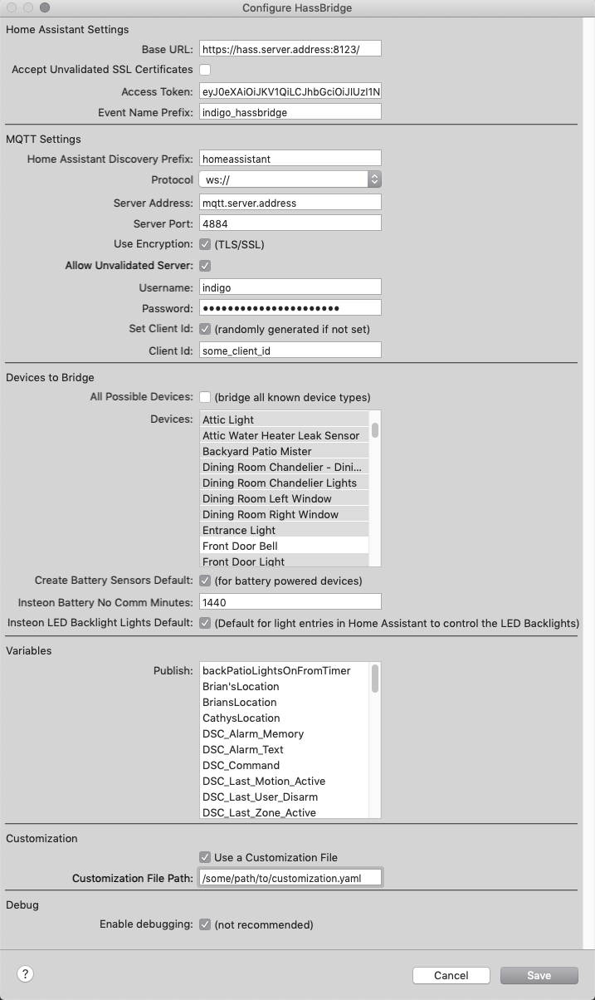

# HassBridge

This is an plugin for [Indigo Domotics](https://www.indigodomo.com/) to bridge 
to [Home Assistant](https://www.home-assistant.io/) using its 
inbuild [MQTT discovery](https://www.home-assistant.io/docs/mqtt/discovery/) 
and [events system](https://www.home-assistant.io/docs/configuration/events/).

It provides a bi-directional bridge for the devices directly controlled by 
Indigo and allows Home Assitant to be able to be able to control and use those 
devices.  It is able to send actions like button presses to Home Assistant to be 
able to be handled as events.  It also allows for Indigo Variables to be displayed 
as Sensors in Home Assistant.

## Features

* Home Assistant Auto Discovery of published Indigo devices
* Bi Directional control of Indigo connected devices
* Expose keypad and remote button presses as Home Assistant Events and Device Actions.
* Expose Indigo Variables as Home Assistant Sensors
* Allows for customization how Indigo devices are represented in Home Assistant. 


## Dependencies
### MQTT Server
HassBridge uses MQTT to communicate with Home Assistant.  If you are using Hass.io you can use one of serveral MQTT 
addons that are available.  Or you can setup your own MQTT/Mosquito server.  As long as its setup and availabel to both 
Indigo and Home Assistant it should work.
 
 
### Home Assistant MQTT Discovery
In order for Home Assistant to register and use the devices published by HassBridge, the Home Assistant MQTT Discovery 
must be turned on when you enable MQTT in Home Assistant. 

## Installation
HassBridge is an Indigo plugin and can be installed by double clicking the downloaded release while on machine that 
Indigo is installed on.   

## Configuration



### Home Assistant Settings
| Config Option | Description |  
|:----|:---|  
| Base URL | The Base URL of your Home Assistant install. |
| Accept Unvalidated SSL Certificates | Allows you to use selfsigned certs. |
| Access Token | Access token to allow API access to send events to HA. |
| HA Event Name Prefix | The prefix for event names being sent to HA.<br /><br/>**indigo_hassbridge**_instant_on for example |

### MQTT Settings
| Config Option | Description |  
|:----|:---|  
| HA Discovery Prefix | The MQTT prefix for Home Assistant Discovery. |
| Protocol | The MQTT protocol to use.  Websockets or TCP. |
| Server Address | The hostname or IP of your MQTT server. |
| Server Port | The port your MQTT server listens on. |
| Use Encryption | Should the HassBridge connection to the MQTT server use SSL/TLS. |
| Allow Unvalidated Server | Should HassBridge check for a valid TLS certificate. |
| Username | Username to connect to the MQTT server with. |
| Password | Password to connect to the MQTT server with. |
| Set Client ID | Do you want to set a manual MQTT client id.<br /><br/>If not a random client id is generated. |
| Client Id | The client id to connect to the MQTT server with.|

### Devices to Bridge
| Config Option | Description |  
|:----|:---|
| All Possible Devices | Bridge all devices that are known HassBridge types.|
| Devices | Select devices to bridge. Use Cmd-Click to select multiple. |
| Create Battery Sensors | Automatically create HA Battery sensors for devices that are known battery powered devices.<br/><br/>Will show low battery when there has been no communications for 24 hours.|

### Variables
| Config Option | Description |  
|:----|:---|
| Publish | Select which Variables to publish to Home Assistant as Sensors.<br/><br/>If the variable is showing true or false it will publish it as a **binary_sensor**, else it will publish it as a **sensor** type.|

### Customization
| Config Option | Description |  
|:----|:---|
| Customization File Path | The full filesystem path to the customization yaml file. |

### Debug
| Config Option | Description |  
|:----|:---|
| Enable Debugging | Turns on debug logging.  Logs a lot.  I mean A LOT.  Dont do it unless you really need to.|
 

## Customization File
HassBridge output to the MQTT server is very customizable.  Almost every config options 
set to the HA MQTT discovery is configurable.  The config file is written in YAML and should
be simple to work on.  You should be used to this type of thing with Home Assistant anyways :).

One of the most used things will be to change the **device_class** sent to Home Assistant.  
This is also customizable in Home Assistant itself if need be.

 
### Sample Customization YAML
```
devices:
  Driveway Gate:           # Indigo device name
    config_vars: 
      device_class: door   # Home Assisntant discovery config entry 
  East Side Gate:
    config_vars:
      device_class: door
  Gun Cabinet:
    config_vars:
      device_class: safety
  Street Gate:
    config_vars:
      device_class: door
  West Side Gate:
    config_vars:
      device_class: door
  Outside Backyard East Gate:
    config_vars:
      device_class: door
  Outside Backyard West Gate:
    config_vars:
      device_class: door
  Garage Door:
    config_vars:
      device_class: garage
  Some Insteon Switchlink:
    enable_led_backlight_light: True
    backlight_set_mechansim: swl        # this is the older protocol. default is kpl (newer command)   

variables:                        
  front_door_state:                    # Indigo variable name
    name: Front Door State             # Friendly name for Home Assistant
    bridge_type: VariableBinarySensor  # Set this to be a binary_sensor type
    on_value: Open                     # Value to look for for On state for Binary Sensor     
    config_vars:
      device_class: door               # Home Assisntant discovery config entry 
  suite_room_window_state:
    on_value: Open
    bridge_type: VariableBinarySensor
    config_vars:
      device_class: window
 ```


## General Device Mapping
| Indigo Device Class | Home Assistant Type |  
|:--------------------|:----------------------|  
| SensorDevice | **sensor** *if device can have a non on/off value*<br />**binary_sensor** *if not* |  
| RelayDevice | **switch** |  
| DimmerDevice | **light** |  
| SpeedControlDevice | **fan** |
| MultiIODevice | **cover** |


